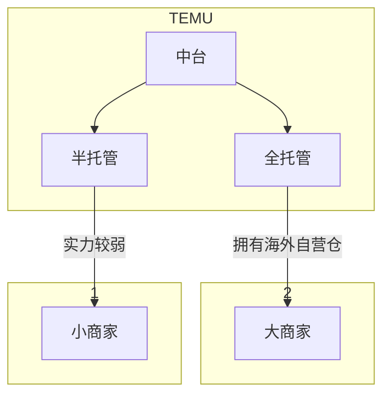

```mermaid
flowchart TB


    subgraph TEMU
    c1[中台]-->quan[全托管]
    c1-->ban[半托管]
    end
    
     subgraph 1
   ban--实力较弱--> a1[小商家]
    end


    subgraph 2
    quan--拥有海外自营仓-->b1[大商家]
    end
```