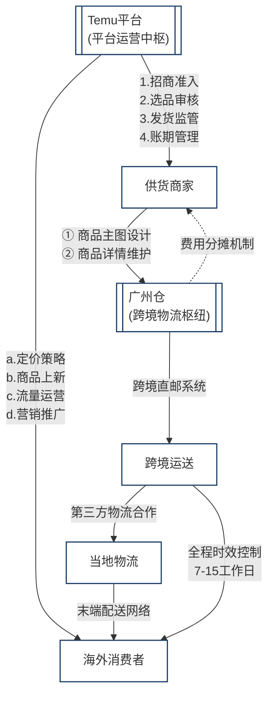

```mermaid
graph TD
    %% 主体流程
    A[["Temu平台
    (平台运营中枢)"]] -->|1.招商准入<br>2.选品审核<br>3.发货监管<br>4.账期管理| B[供货商家]
    A -->|a.定价策略<br>b.商品上新<br>c.流量运营<br>d.营销推广| C[海外消费者]
    B -->|① 商品主图设计<br>② 商品详情维护| D[["广州仓
    (跨境物流枢纽)"]]
    D -->|跨境直邮系统| E[跨境运送]
    E -->|第三方物流合作| F[当地物流]
    F -->|末端配送网络| C
    
    %% 时效标注
    E -->|全程时效控制<br>7-15工作日| C
    D -.->|费用分摊机制| B
    


    %% 样式定义
    classDef main fill:#fff,stroke:#1a3d66,stroke-width:1.5px,text-align:left
    classDef node2 fill:#fff,stroke:#4CAF50,stroke-width:1.5px
    classDef title fill:#f5f5f5,stroke:none,font-size:12px
    classDef source fill:#fafafa,stroke:#999,stroke-width:0.8px,font-size:10px
    class A,B,C,D,E,F main
    class G source
    class H title
```