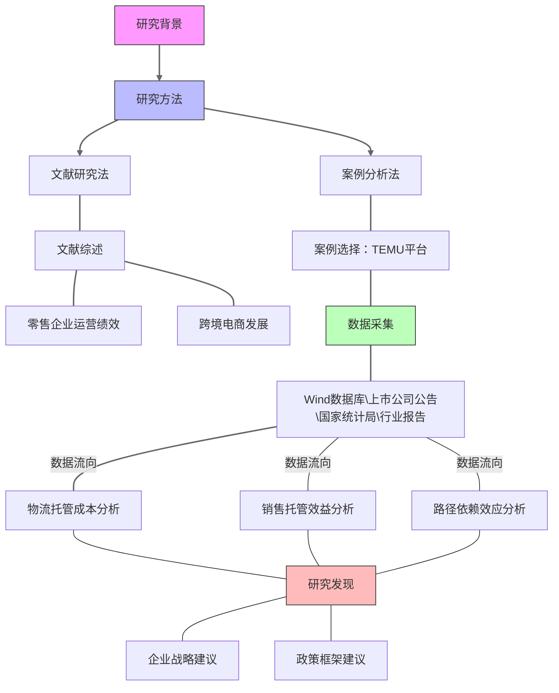

```mermaid
graph TD
    A[研究背景] --> B[研究方法]
    B --> B1[文献研究法]
    B --> B2[案例分析法]

    B1 --- C[文献综述]
    C --- C1[零售企业运营绩效]
    C --- C2[跨境电商发展]

    B2 --- D[案例选择：TEMU平台]
    D --- D1[数据采集]
    D1 --- D11[Wind数据库\上市公司公告\国家统计局\行业报告]

    D11---|数据流向| E1[物流托管成本分析]
    D11---|数据流向| E2[销售托管效益分析]
    D11---|数据流向| E3[路径依赖效应分析]

    E1 & E2 & E3 --- I[研究发现]
    I --- J[企业战略建议]
    I --- K[政策框架建议]

    style A fill:#f9f,stroke:#333
    style B fill:#bbf,stroke:#333
    style D1 fill:#bfb,stroke:#333
    style I fill:#fbb,stroke:#333

    linkStyle 0,1,2,3,4,5,6,7,8,9 stroke:#666,stroke-width:2px
```