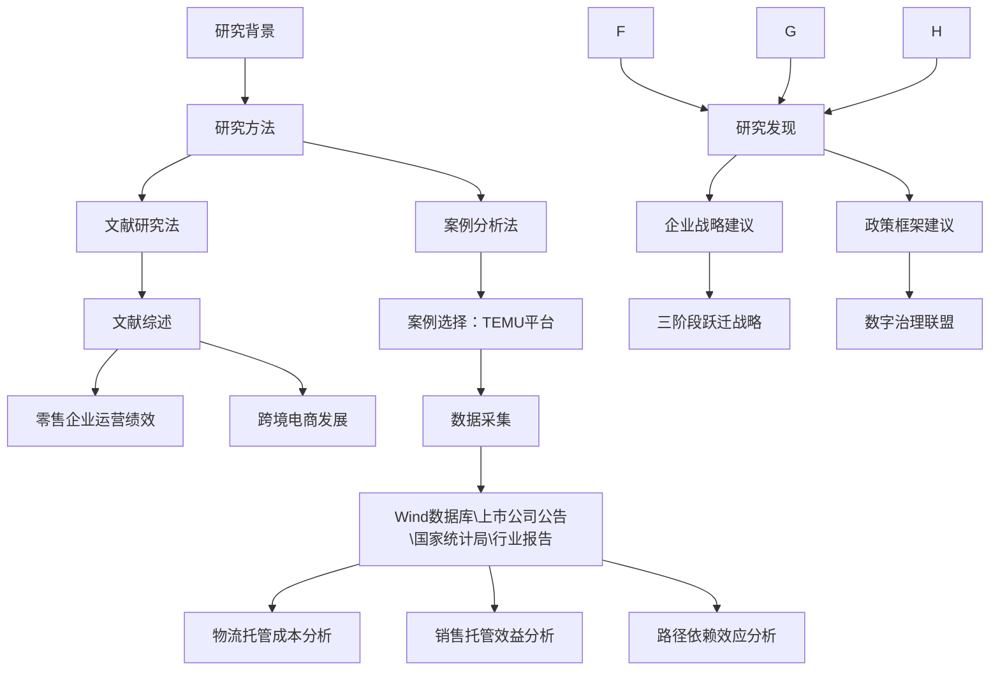

```mermaid
graph TD
    A[研究背景] --> B[研究方法]
    B --> B1[文献研究法]
    B --> B2[案例分析法]

 
    
    B1 --> C[文献综述]
    C --> C1[零售企业运营绩效]
    C --> C2[跨境电商发展]

    
    B2 --> D[案例选择：TEMU平台]
    D --> D1[数据采集]
    D1 --> D11[Wind数据库\上市公司公告\国家统计局\行业报告]

    
    D11--> E1[物流托管成本分析]
   D11 --> E2[销售托管效益分析]
    D11 --> E3[路径依赖效应分析]

    F & G & H --> I[研究发现]
    I --> J[企业战略建议]
    I --> K[政策框架建议]
    
    J --> J1[三阶段跃迁战略]
    K --> K1[数字治理联盟]
    

```